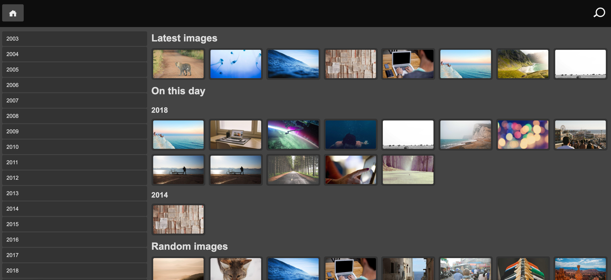

Ralbum
===================

## What does this do?
It generates a list of folders and images (and other files) as they exist on the filesystem.
When browsing the images they will be displayed in a light-box and can be browsed using buttons, 
swipe actions on smart-phones and with the keys of your keyboard. The original files will only be
read, no write actions are performed on the original files. For all images a smaller version of the 
image will be generated (on the fly or preferably using cron.php).



## Features

### Image viewing
You can choose to browse the original images or view a re-sized version of the images (default). 
This is convenient when you are browsing on a slow connection. 
You can control the size of these images in settings.json. 
These images are created on the fly or you can use the cron.php to create these (and the thumbnails) all at once.
If you leave the main folder of your images empty, you will see a list of recent images and a list of images of the same date in history and a list of random images.

### Search
You can search (if you have cron enabled, see below) for images using the search box on the top right. You can enter multiple words to further
narrow the results.

### Map
Images with geographical information embedded in the EXIF can be displayed on a map. Open the the submenu of the search function to locate the link to the map.

## Installation

You can install this using Docker or on your base system, Docker is the easiest way because you won't have to check for certain software compatibility. You _do_ need to install Docker of course.

### Installation using Docker

Create a docker-compose.yml file and replace '/var/www/testfoto' with the image directory on your server. The other volumes are optional but they make it easier to upgrade to a new version later (without having to rebuild the cache and index). Make sure your docker instance has write access to the cache and data folder. After creating the docker-compose.yml you can start the container using `docker compose up -d` (or `docker-compose up -d` on older docker systems)

```
services:
  ralbum_live:
    image: ralbum/ralbum
    container_name: ralbum_live
    ports:
      - "1247:80"
    volumes:
      - /var/www/testfoto:/var/data
      - /var/ralbum/cache/live:/var/www/html/cache
      - /var/ralbum/data/live:/var/www/html/data
    restart: unless-stopped

```

If you want to use custom settings you can add this extra volume, but the default settings work for most users.
You can find the additional settings in sub/app/src/Ralbum/Setting.php

```
- /location/of/your/settings.json:/var/www/html/settings.json
```

If you have your docker container running you can use that as-is but it's better to have that running on it's on own host/domain (and without the port number), here is the relevant apache configuration for your VirtualHost, again, replace the portnumber if you wish.

```bash
ProxyPass / http://127.0.0.1:1247/
ProxyPassReverse / http://127.0.0.1:1247/
```

Of course you can also set this up using nginx. I don't have an example ready but if you run nginx you probably know how to do this.

If you want to use the search feature you need to run a cronjob. Running the cron from inside a docker container sucks, it's easier to do this from the host system like so.

```bash
/usr/bin/docker exec ralbum_live /var/www/html/ralbum_cron.sh
```

That's it for the installation, if you want to you can also build it yourself using:
The `build` folder contains a Dockerfile, instructions for installing:
Enter the `build` directory on the command-line and execute the command below to create the `ralbum` image:

```bash
docker build --no-cache -t ralbum .
```


## Installation on your base system

### Requirements
* PHP 7.0 and up
* Apache with mod_rewrite or nginx (nginx-light on Debian should suffice)
* Either PHP's GD library but preferably the Imagick extension (and ImageMagick installed)
* SQLite, this is optional (for search feature and dashboard), usually comes with PHP

### Procedure
* Copy the contents in your DocumentRoot, this can also be a sub-folder
* Install composer (if you haven't done so already). Get it from [https://getcomposer.org/](https://getcomposer.org/) or use your system's package management
* `cd app`; `composer install`; `cd ..`;
* Edit `settings.json` and set `image_base_dir` to the directory where your images are located
* Set permissions to the 'cache' and 'data' folder so your webserver user can write to it
* Done

To use the search feature you need to run the cron.php file to generate the index (on a daily basis for example). You should run this command
as the webserver user, for example:
```bash
sudo -u www-data php cron.php
```

